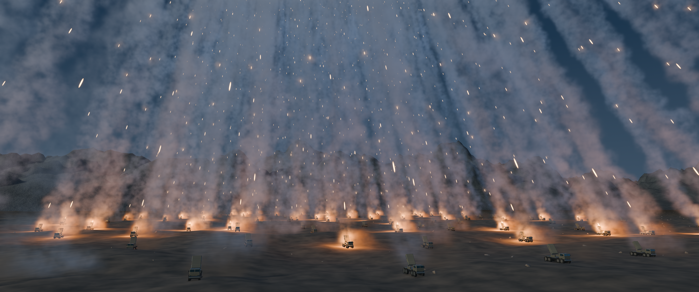

# CANOPY / 齐射烟幕

一个可编辑、无外部素材依赖的 Blender 动画场景。

## n8 重渲染版本

`Canopy_n8.blend`、`Canopy_n8_3840x1608_24fps.mp4` 和 `Canopy_n8_Hero_3840x1608.png` 为 n8 重渲染版。原始版本仍保留，便于比较。

n8 使用 RTX 4070 Ti SUPER（16 GB）和 Blender 5.2.2 LTS。新版保留原场景、发射时序、摄影机与分辨率，将 EEVEE 渲染采样从 32 提升到 96，体积采样从 128 提升到 192，体积阴影采样从 48 提升到 64。Hero 静帧来自新版影片第 180 帧。

`n8_render_validation.json` 记录渲染设置和完整性检查；`SHA256SUMS_n8.txt` 可用于核对新版三个主要文件。打开新版场景后，随附的 `render_scene.py` 同样可用于重渲染。

已比较 Cycles 测试，但本次完整成片采用 EEVEE。此版提升渲染采样精度，没有改变烟雾的程序化生成方式或增加流体模拟，因此下述写实度限制仍适用。

## 交付文件

- `Canopy.blend`：Blender 5.2 场景，包含车辆、地形、摄影机、体积烟雾、发射时序和灯光动画。
- `Canopy_3840x1608_24fps.mp4`：3840 × 1608，24 fps，336 帧，14 秒，单一连续镜头，无音轨。
- `Canopy_Hero_3840x1608.png`：取自最终镜头第 180 帧的原生分辨率静帧。
- `launch_manifest.csv`：全部 3,456 次发射的车辆编号、弹序、帧号和影片时间。
- `scene_validation.json`：场景计数、时序和视频规格的检查结果。

## 时间轴

| 段落 | 时间 / 帧 |
| --- | --- |
| 阵地建立 | 0–2 秒 / 1–48 帧 |
| 首次发射 | 2.000 秒 / 第 49 帧 |
| 发射波及全阵列 | 首发后不到 1 秒 |
| 最后一次发射 | 8.583 秒 / 第 207 帧 |
| 烟幕余景 | 尾焰逐渐离场，直至第 336 帧 |

144 台车各发射 24 枚，间隔 6 帧（每秒 4 枚）。每台车首末两枚相隔 5.75 秒，对应约 6 秒的完整发射窗口。最后约 3 秒只保留烟雾与地形。

## 编辑

在 Blender 5.2 中打开 `Canopy.blend`。无需安装插件、下载贴图或运行脚本。场景使用 EEVEE 渲染；打开后可通过数字键盘 0 切换到摄影机视图。编辑地形或车辆时可临时隐藏烟雾集合以改善交互速度。

- **整体烟雾**：选择 `SHOT CONTROLS • smoke and wind`，在自定义属性中调整 `Turbulence`（扰动）、`Expansion`（随年龄扩散）、`Crosswind`（横风）。
- **烟迹细节**：`03 • Exhaust volumes — animated Geometry Nodes` 集合包含三个纵深层和独立地面尘烟。Geometry Nodes 控制烟迹年龄、漂移、体积半径和体素尺寸。烟雾材质控制密度、细节与散射。
- **车辆**：`02 • 144 launchers — linked editable geometry` 中每台车可独立变换。全部实例引用 `SOURCE • Fictional 8×8 launcher geometry` 源集合；在 Outliner 的 Blender File 模式下找到并编辑该集合，修改会同步到所有车辆。若需要逐台改造，可先将选定实例转换为独立对象。
- **火箭与时序**：`3,456 timed rocket exhaust cores` 的点属性 `launch_seconds` 和 `velocity` 控制独立火箭。烟迹点的 `birth_seconds` 控制相应轨迹各段的出现时刻。修改发射时间时应同步相应的烟迹属性和灯光关键帧。车辆上的时序自定义属性与 CSV 是清单信息，不会自动重建上述动画。
- **秒数基准**：节点中的秒数采用 Blender Scene Time，即 `帧号 / 24`；CSV 的 `seconds` 从影片第 1 帧计为零，即 `(帧号 − 1) / 24`。直接用 CSV 调整点属性时应补上 `1/24` 秒。
- **重新布局**：发射点和烟迹使用世界坐标。移动车辆时，需要同步移动其对应的火箭点、烟迹点和灯光；车辆变换不会自动重建这些路径。
- **摄影与照明**：`05 • Camera and blue-hour lighting` 控制缓慢的机位移动、暮光与填充光。`04 • Rocket tips and localized ignition lights` 控制短促点火及选定尾焰的局部烟雾照明。
- **渲染**：输出规格已保存为 3840 × 1608、24 fps、1–336 帧。修改输出位置后用 Render Animation 渲染；也可用随附 `render_scene.py` 输出 PNG 序列，再编码影片。

## 技术边界

烟雾是真正的三维稀疏体积，由带年龄的轨迹点和连续噪声驱动，支持遮挡、受光和重新取景；它不是二维背景或预渲染贴片。场景采用程序化体积动画，没有执行高分辨率流体动力学模拟。当前画面仍有程序化 CG 的形态与材质特征，不能宣称已经达到“与高预算实拍 VFX 无法区分”的标准。

全部车辆与地形均为本场景原创程序化几何，无外部资产或纹理依赖。影片不包含国家标志、文字、弹着爆炸或冲击波。

